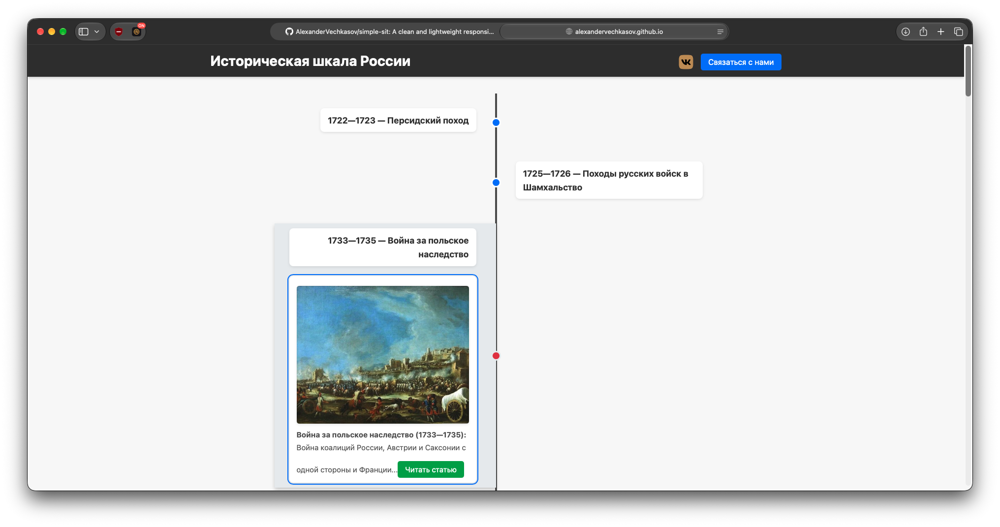

# Simple Site 🌐

[](https://alexandervechkasov.github.io/simple-sit/)
[](https://github.com/AlexanderVechkasov/simple-sit)
[](LICENSE)

> Легкий, быстрый и адаптивный веб-сайт, опубликованный с помощью бесплатного хостинга GitHub Pages.

🔗 **Рабочая версия сайта:** [alexandervechkasov.github.io/simple-sit](https://alexandervechkasov.github.io/simple-sit/)

---

## 📸 Превью

<!-- 
Чтобы добавить скриншот:
1. Сделайте снимок страницы и назовите его preview.png
2. Загрузите файл в репозиторий (Add file -> Upload files)
3. Раскомментируйте строку ниже:
-->
<!--  -->

---

## ✨ Особенности

* 📱 **Адаптивный дизайн:** интерфейс автоматически подстраивается под экраны смартфонов, планшетов и широкоформатных мониторов.
* ⚡ **Высокая производительность:** чистый код без тяжелых внешних библиотек и зависимостей, обеспечивающий мгновенную загрузку.
* 🚀 **Автоматический деплой:** сайт работает на GitHub Pages и автоматически обновляется при каждом пуше в ветку `main`.
* 🧱 **Семантическая разметка:** код структурирован по стандартам HTML5 для доступности и правильной индексации поисковиками.

---

## 🛠 Стек технологий

| Технология | Назначение |
| :--- | :--- |
|  | Семантическая структура страницы |
|  | Таблицы стилей, Flexbox / CSS Grid, адаптивные медиа-запросы |
|  | Интерактивные элементы и поведение интерфейса |
|  | Статический веб-хостинг |

---

## 🚀 Локальный запуск проекта

Если вам нужно открыть и протестировать проект на локальном компьютере:

1. **Клонируйте репозиторий:**
   ```bash
   git clone https://github.com/AlexanderVechkasov/simple-sit.git
   cd simple-sit
